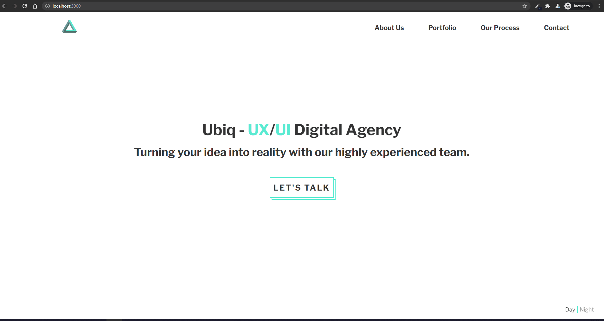
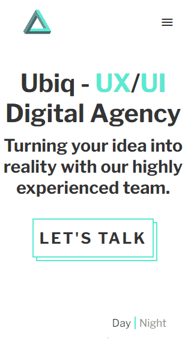

# Project 1 - Dark/Light theme Software House Website

## Purpose

Create mockup website of a Software House with Dark/Light theme switching.

## Tech Stack :hammer_and_wrench:

- Bootstrapped with [Create React App](https://github.com/facebook/create-react-app)
- Add custom stylings with _sass modules_
- Use `React.Context` for theme switching

## Potential Improvements

- In case of more sophisticated routes (nested or private) I would define some generic mechanism based on `map` to properly generate routes
- Store text contents in corresponding file `componentName.const.ts(x)` in case of possible usage of `i18n`
- In case of SSR I would use [Next.js](https://github.com/vercel/next.js) (additional improvement is for image caching in portfolio section)
- Download only used icon (hamburger menu) instead of fetching all _Material Icons_
- Provide better UX for mobile navigation (smoother transition, microinteraction)

## Demos

