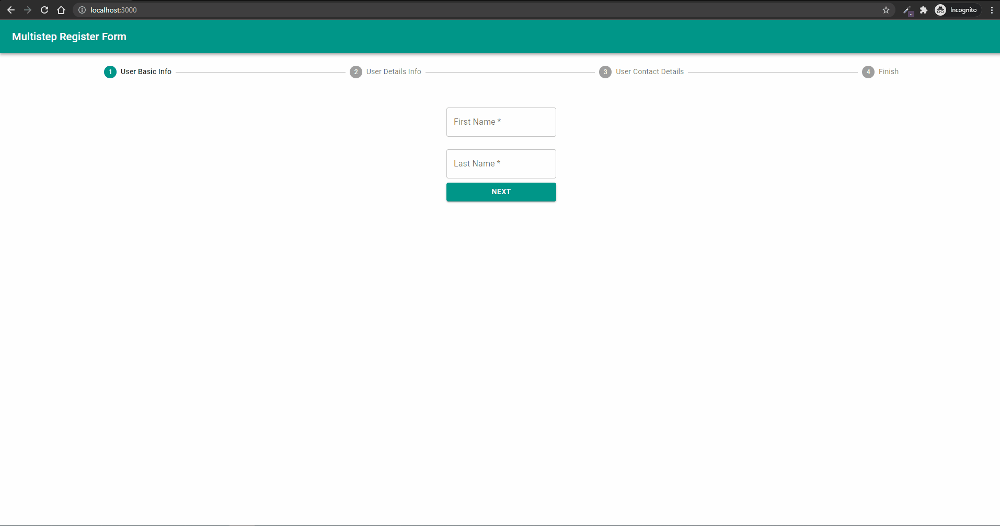

# Project 3 - Multistep Register Form

## Purpose

Create multistep register form with validation and stepbar.

## Tech Stack :hammer_and_wrench:

- Bootstrapped with [Create React App](https://github.com/facebook/create-react-app)
- Use [MUI](https://mui.com/) as a design system

## Potential Improvements

- Probably use [Formik](https://formik.org/) or [react-hook-form](https://react-hook-form.com/) for validation

## Demos

