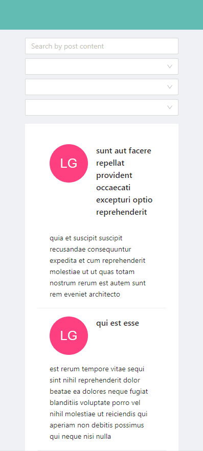

# Project 4 - Pagination with fake API

## Purpose

Create pagination component based on fake API with dynamic search.

## Tech Stack :hammer_and_wrench:

- Bootstrapped with [Create React App](https://github.com/facebook/create-react-app)
- Use [Ant Design](https://ant.design/) as a design system
- Use [Styled Components](https://styled-components.com/) for stylings
- Use [JSON Placeholder](https://jsonplaceholder.typicode.com/) to make fake API calls

## Potential Improvements

- Probably switch to observables from [RxJS](https://rxjs.dev/) instead of Promise based approach

## Demos

