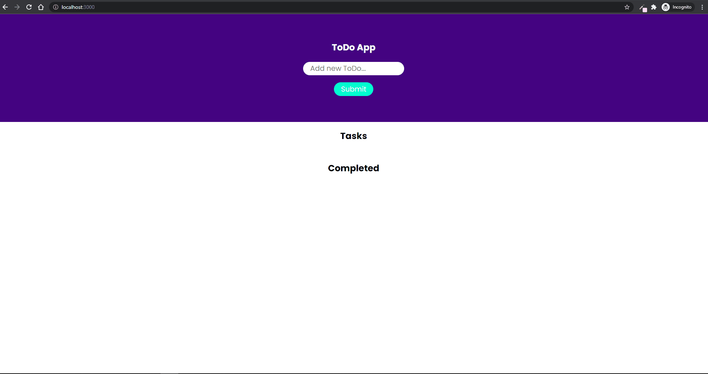

# Project 5 - ToDo App with Redux

## Purpose

Create simple ToDo app with Redux and custom components.

## Tech Stack :hammer_and_wrench:

- Bootstrapped with [Create React App](https://github.com/facebook/create-react-app)
- Use [Redux Toolkit](https://redux-toolkit.js.org/)
- Use [Styled Components](https://styled-components.com/) for stylings

## Potential Improvements

- Better definitions for global styles and theme

## Demos

